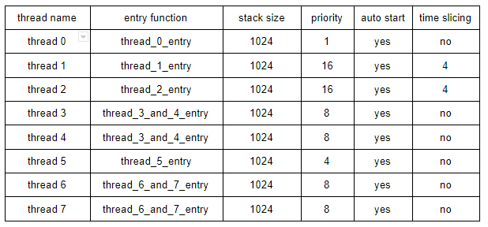
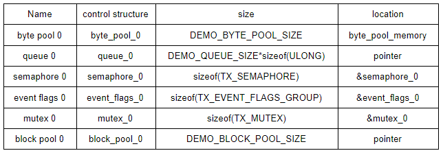
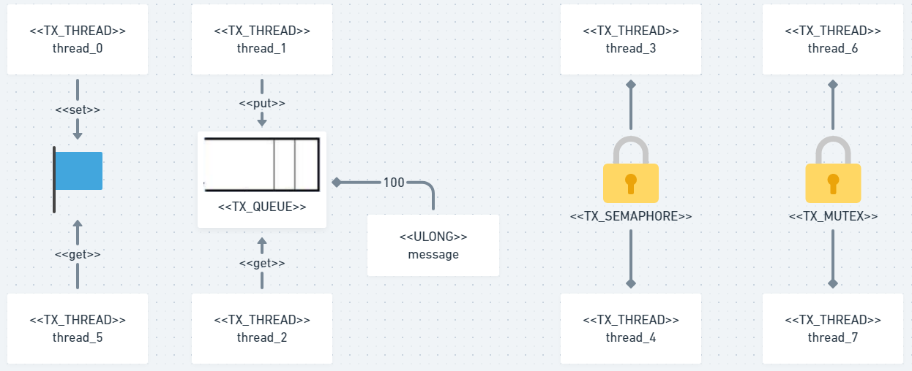

# gabrielkuhnenb_ELF74

Lab1 - Hello world aparece no Terminal I/O

Lab2 - Variáveis volatile podem ser modificadas a qualquer momento, mesmo que o compilador não encontre a fonte da mudança no código.
Isso dificulta a otimização do código onde essa variável é utilizada e, por isso,
é bastante utilizada para acesso a hardware, mapeamento de memória de I/O e threading.

Lab5
Tabela1

Tabela2

Diagrama

